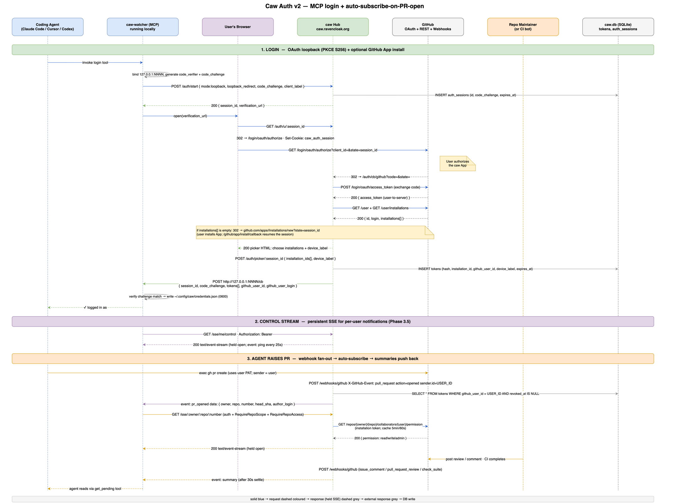

# Caw

[](https://github.com/ravencloak-org/caw/actions/workflows/ci.yml)
[](https://codecov.io/gh/ravencloak-org/caw)

> Push PR feedback to the agent that raised the PR — so it fixes its own PR without being prodded.

**Install (Claude / Cursor / Codex CLI):** see [`docs/install/`](./docs/install/).

When an AI agent raises a pull request, getting it green (CI, review comments, mergeability) usually means a human babysitting the PR and re-prompting the agent every time something fails. Caw inverts that: GitHub webhooks are compiled into a single summary and **pushed** to the agent over a held-open SSE connection, so the agent that raised the PR keeps working it on its own. If that agent is gone, the summary waits as a *pending item* for the next agent to pick up.

Caw is **harness-agnostic** (any MCP client — Claude, Gemini, OpenAI, Cursor) and **reviewer-agnostic** (any commenting bot or human — CodeRabbit, Sonar, Snyk, …).

See [`CONTEXT.md`](./CONTEXT.md) for the canonical glossary and [`docs/adr/`](./docs/adr/) for the load-bearing decisions.

## How it works

```
GitHub ──webhooks──▶ Hub ──compile──▶ SSE push ──▶ Watcher ──▶ Session (listening agent)
                      │                                              fixes in worktree, pushes
                      └─ no listener? store as Pending item ──▶ next Session's startup check ──▶ prompt human
```

### End-to-end sequence (Auth v2)

Full login + auto-subscribe-on-PR-open flow, from a coding agent invoking the `login` MCP tool through to the summary push back. Spans the OAuth loopback handshake (PKCE), optional GitHub-App install resume, the persistent per-user control stream, and the per-PR SSE driven by webhook fan-out.

[](docs/images/auth-v2-flow.drawio)

_Source: [`docs/images/auth-v2-flow.drawio`](docs/images/auth-v2-flow.drawio) — open in [draw.io](https://app.diagrams.net/) to edit. See the phased plan + ADR-0011 (forthcoming) for the implementation slices._

**Live path.** A **Session** raises a PR; its **Watcher** (a local MCP server) opens and *holds* an SSE connection to the **Hub** keyed `owner/repo#number`. Many Sessions may subscribe to the same PR — summaries **fan out** to all listeners. The Hub ingests that **Round**'s GitHub webhooks; once checks settle (`check_suite completed` + ~30s grace) it runs the one poll (mergeability), compiles a summary, and pushes it down the held connections. A late same-SHA signal (async review comment, flipped check) **re-settles** the Round and pushes a follow-up (one summary *per settle* — [ADR-0004](./docs/adr/0004-rounds-re-settle-on-late-same-sha-signals.md)). The Session acts in the PR's worktree, pushes, and the next Round begins. A new head SHA supersedes the prior Round.

**Catch-up path.** Zero live Subscriptions → the summary is stored as a **Pending item** (latest-state per signal-type — [ADR-0006](./docs/adr/0006-pending-is-latest-state-per-type-consumer-owns-relevance.md)). A brand-new Session makes **one** request at startup ("anything pending?"), surfaced by a SessionStart hook, gets *all* current items, and prompts the human before acting on work it didn't start.

**The only poll in the whole system** is the mergeability/conflict re-verify after a Round settles. Everything else is webhook push (GitHub → Hub) and SSE push (Hub → Watcher). The startup pending-check is a single one-shot request, not polling.

## Signal-types

Feedback is surfaced as three dynamic signal-types; sources within each are attributed at runtime, never hardcoded.

| Signal-type | GitHub source | Notes |
|---|---|---|
| **Checks** | `check_suite` failures | CI, Squawk-as-check, Sonar-as-check… |
| **Comments** | `pull_request_review`, `pull_request_review_comment`, `issue_comment` | Any bot or human; severity normalised for first-class sources (CodeRabbit first) |
| **Mergeability** | poll of `GET /pulls/{n}` after settle | Behind-base & clean → rebase under a Hub-granted single-owner **rebase lease** (listener, or Hub for orphans — [ADR-0005](./docs/adr/0005-hub-granted-rebase-lease.md)); then auto-merge |

Severity renders as **label + symbol + colour** (e.g. `■ CRITICAL` / `▲ MAJOR` / `· minor`), never colour alone — readable on colourblind-accessible terminal themes and on no-colour terminals.

**Mapping onto the ladder.** The severity ladder is **closed** (a fixed 3–4 levels); the **adapters** that map each source's own vocabulary onto it are **open/pluggable** — matching "sources attributed dynamically, never hardcoded." Each first-class source (CodeRabbit first) ships a parser; everything else falls through to defaults (failing check → `MAJOR`; bare human/bot comment or unparseable → `minor`). New sources = new adapters, no ladder change. (Reversible; parked here, not an ADR.)

## Components

### Hub (Go + Gin + SQLite)
One portable service; identical artifact self-hosted or run as SaaS ([ADR-0001](./docs/adr/0001-portable-go-sqlite-hub-over-cloudflare.md)). HTTP layer is Gin (SSE routes exempted from buffering middleware).

- **Webhook ingress** — `POST /webhooks/github`, verifies `X-Hub-Signature-256`, dedupes, buckets by `owner/repo#number @ sha` (Round).
- **Round settle** — on `check_suite completed` + grace window, run the mergeability poll, compile the summary.
- **SSE** — `GET /sse/{owner}/{repo}/{number}` (authenticated via Hub-minted installation token — [ADR-0003](./docs/adr/0003-sse-auth-via-hub-minted-installation-token.md)); fans compiled summaries out to all held connections for the key.
- **Pending store** — SQLite; latest summary per PR per signal-type when no listener; newer same-type events replace, nothing else clears. `GET /pending` (one-shot startup check, returns all). No `ack` ([ADR-0006](./docs/adr/0006-pending-is-latest-state-per-type-consumer-owns-relevance.md)).
- **Rebase lease** — Hub grants the single force-push lease to one actor via `POST /leases/{owner}/{repo}/{number}` (renew with `PUT …/heartbeat`, drop with `DELETE …`); for orphaned PRs the Hub itself takes it: "Update branch" + enable auto-merge ([ADR-0002](./docs/adr/0002-agent-owned-rebase.md), [ADR-0005](./docs/adr/0005-hub-granted-rebase-lease.md)).

### Watcher (MCP server)
Local, runs in the harness; the universal contract across harnesses.

- `subscribe_pr(owner, repo, number)` — opens & holds the SSE; returns compiled summaries as they arrive (fan-out: co-existing with other listeners is fine).
- `get_pending()` — one-shot; returns all current Pending items across the installation, each with `timestamp`, head `SHA`, and PR state for relevance filtering.
- `acquire_rebase_lease(owner, repo, number)` — requests the single force-push lease before rebasing; granted to one actor ([ADR-0005](./docs/adr/0005-hub-granted-rebase-lease.md)).
- Renders summaries (label + symbol + colour). SessionStart hook reminds the agent to call `get_pending()`.

### GitHub App
Auth for both modes via the App Manifest flow — the App is the Hub's GitHub identity, never a stored PAT.

- **SaaS:** hosted App; user clicks *Install*, picks repos. No stored PATs.
- **Self-host:** `GET /github/app/manifest` runs the Manifest flow and provisions the user's own App pointing at their Hub; `GET /github/app/callback` mints and persists the credentials. Both routes are gated by `CAW_BOOTSTRAP_TOKEN` (sent as `Authorization: Bearer …` or `X-Caw-Token`) and stay disabled until it is set — and refuse to overwrite live credentials unless `ALLOW_REBOOTSTRAP=1` ([ADR rationale in CONTEXT](./CONTEXT.md)).
- Events: `check_suite`, `pull_request`, `pull_request_review`, `pull_request_review_comment`, `issue_comment`.
- Permissions (pin exact scopes at build): `pull_requests:read/write`, `contents:write`, `checks:read`.
- The **local agent keeps its own `gh`/git creds** — the App is the Hub's identity only.

## Self-host

The Hub is a single static binary ([ADR-0001](./docs/adr/0001-portable-go-sqlite-hub-over-cloudflare.md)); `docker compose up` brings up the Hub **+ bundled OpenObserve** (default OTLP sink — [ADR-0008](./docs/adr/0008-observability-via-otel-and-bundled-openobserve.md)).

```sh
cp .env.example .env        # then fill in secrets (see below)
docker compose up           # Hub on :8080, OpenObserve UI on :5080
```

Required `.env` values:

- `CAW_GH_WEBHOOK_SECRET` — shared secret to verify GitHub's `X-Hub-Signature-256`; set the same value in the App's webhook config.
- `CAW_BASE_URL` — this Hub's public URL (e.g. `https://caw.example.com`); required for the manifest flow.
- `CAW_BOOTSTRAP_TOKEN` — one-time operator secret that gates the manifest routes (`openssl rand -hex 32`).
- `ZO_ROOT_USER_EMAIL` / `ZO_ROOT_USER_PASSWORD` and the matching `OTEL_EXPORTER_OTLP_HEADERS` — OpenObserve root login plus its OTLP Basic-auth header (the compose file already wires `OTEL_EXPORTER_OTLP_ENDPOINT=http://openobserve:5081`). Unset the endpoint to disable telemetry export entirely.

Then:

1. **Create the GitHub App** — hit `GET /github/app/manifest` with the bootstrap token in the `Authorization: Bearer` header to run the App Manifest flow; the callback mints and stores the App credentials (App ID, private key, OAuth client) in the Hub's DB.
2. **Install the App** on the repos you want watched.
3. **Get a Watcher token** — when a user installs the App, GitHub redirects them back to `${CAW_BASE_URL}/github/app/install/callback`, which renders the token once for copy-paste into a harness ([ADR-0010](./docs/adr/0010-self-service-watcher-tokens.md)). Operators may still mint tokens server-side via `hub mint-token <installation_id> [org]` for automation or recovery.
4. **Point a Watcher** (the MCP server in your harness) at the Hub URL with that token and `subscribe_pr(owner, repo, number)`.
  - See [`docs/install/`](./docs/install/) for harness-specific configs (Claude Desktop, Cursor, Codex CLI).

**SaaS:** install the hosted App, install the Watcher, subscribe. (Pricing TBD.)

### Limitations of the default image

> **Default image limitation — orphan rebase.** The published `ghcr.io/ravencloak-org/caw` image is distroless/static and does not include `git`. The orphan-rebase fallback (ADR-0005 — the Hub takes the lease and force-pushes when no agent is listening) requires `git` on PATH. If your workflow depends on orphan rebase, run the binary on a host with `git` installed rather than the default container, or build a custom image based on `alpine:3` with `git` + `bash` added. Live-path rebase (where the agent holds the lease and pushes from its own worktree, ADR-0002) is unaffected — that runs in the agent's environment, not in the Hub.

## Observability

The Hub is instrumented with the **OpenTelemetry Go SDK** and emits traces/logs/metrics over **OTLP** to a configurable endpoint — it stores no telemetry itself and stays vendor-neutral ([ADR-0008](./docs/adr/0008-observability-via-otel-and-bundled-openobserve.md)).

- **Default sink: [OpenObserve](https://openobserve.ai)** — one binary, single-node SQLite + local disk (no Prometheus/ClickHouse/Elastic/Grafana, no Postgres/NATS), native OTLP for all three signals, built-in trace/log/metric UI. So self-hosters *see their own OTel stack* with zero extra setup.
- **Bring your own:** point `OTEL_EXPORTER_OTLP_ENDPOINT` at any OTLP backend (your OpenObserve, Grafana/Tempo, Datadog…), or unset it to disable export.
- Telemetry never lands in the Hub's SQLite/Postgres; OpenObserve owns its own storage (local disk, or S3/GCS at scale).

## Build slices

All slices below are merged.

1. **Hub core** — webhook ingest + signature verify + Round bucketing + SQLite pending store.
2. **Compile + SSE** — `check_suite`+grace settle (+ same-SHA re-settle), summary compiler, fan-out SSE push ([ADR-0007](./docs/adr/0007-subscriptions-fan-out.md)), installation-token auth, `get_pending`.
3. **Mergeability poll** — settle-time poll; emit the Mergeability signal.
4. **Watcher MCP** — `subscribe_pr` / `get_pending` / `acquire_rebase_lease`, summary rendering, SessionStart hook.
5. **GitHub App + Manifest** — App, install/manifest flows, installation tokens.
6. **Rebase** — Session-side rebase + Hub orphan fallback + auto-merge under the lease ([ADR-0002](./docs/adr/0002-agent-owned-rebase.md), [ADR-0005](./docs/adr/0005-hub-granted-rebase-lease.md)).
7. **Severity** — CodeRabbit parser → normalised severity (`internal/severity`); label/symbol/colour rendering.
8. **Observability** — OpenTelemetry Go SDK → OTLP, bundled OpenObserve sink ([ADR-0008](./docs/adr/0008-observability-via-otel-and-bundled-openobserve.md)).
9. **Schema source-of-truth** — Dolt versions the schema and generates the SQLite + Postgres DDL ([ADR-0009](./docs/adr/0009-dolt-versioned-schema-source-of-truth.md)).


## Contributing

One-time: `make hooks` — sets `core.hooksPath = .githooks` so every push runs the same gates CI runs (`golangci-lint`, `go vet`, `sqlfluff` when `.sql` changed, schema drift when `db/` changed). Skip a single push with `git push --no-verify` or the whole hook with `CAW_SKIP_HOOKS=1 git push`.

## Roadmap / parked

- **SaaS** hosted offering + pricing.
- **Channels:** an optional Claude push lane, once it reaches general release — the portable contract stays MCP either way.
- Tuning knobs in flight: grace-window duration and rebase-lease TTL/heartbeat.

_Decisions are recorded as ADRs: portable Go+SQLite Hub ([0001](./docs/adr/0001-portable-go-sqlite-hub-over-cloudflare.md)), agent-owned rebase ([0002](./docs/adr/0002-agent-owned-rebase.md)), SSE auth ([0003](./docs/adr/0003-sse-auth-via-hub-minted-installation-token.md)), re-settle ([0004](./docs/adr/0004-rounds-re-settle-on-late-same-sha-signals.md)), Hub-granted lease ([0005](./docs/adr/0005-hub-granted-rebase-lease.md)), pending model ([0006](./docs/adr/0006-pending-is-latest-state-per-type-consumer-owns-relevance.md)), fan-out ([0007](./docs/adr/0007-subscriptions-fan-out.md)), observability ([0008](./docs/adr/0008-observability-via-otel-and-bundled-openobserve.md)), Dolt schema ([0009](./docs/adr/0009-dolt-versioned-schema-source-of-truth.md)), self-service tokens ([0010](./docs/adr/0010-self-service-watcher-tokens.md))._

## Status

POC — all build slices (1–9) merged and **deployed**. A live Hub runs at [caw.ravencloak.org](https://caw.ravencloak.org) (Docker + Cloudflare tunnel). Design converged; see `CONTEXT.md` + the ADRs.

Releases: [CHANGELOG.md](./CHANGELOG.md) · [GitHub releases](https://github.com/ravencloak-org/caw/releases).
